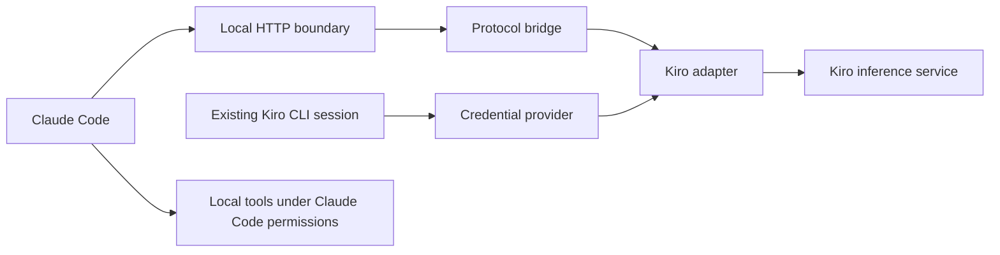

# 0001. Go gateway stack and architecture

**Date**: 2026-09-30
**Status**: Accepted

## Summary

You run one Go gateway in a terminal and use Claude Code in another. Claude Code keeps control of conversation history, permissions, and tool execution. A replaceable Kiro adapter initially uses your existing Kiro CLI session with IAM Identity Center. Further product work depends on proving that this connection can complete a real Claude Code tool loop.

## Requirements

These observable constraints are derived from the scope and your selected architecture. The scaffold and later bridge implement them at their respective scope milestones.

1. **AC-1**: The foundation builds and runs as one foreground Go executable on the initial macOS machine. Its adapter boundary does not require another application process.
2. **AC-2**: The local HTTP surface accepts only loopback connections and requires a separate gateway credential. Missing or invalid credentials fail without account access.
3. **AC-3**: Startup failures are visible and shutdown is bounded. Routine output excludes secrets and conversation content.
4. **AC-4**: The first live slice leaves sign in with Kiro CLI and tool execution with Claude Code. Compatibility is not declared until the documented streaming, tool result, and follow up loop passes.

## Decision

**Chosen option**: Option 1, a single Go executable with internal modules and a replaceable upstream adapter.

**Decision confirmed**: You accepted this spec on September 30, 2026, after the independent review and its wording clarifications. You confirmed foundation completion on October 1, 2026, after implementation, verification, and passing tests.

Use a foreground process on macOS, Go standard library HTTP, and the existing Kiro CLI sign in for the first slice. Investigating an undocumented inference interface is authorized, but its compatibility remains unproven. These choices reflect your interview answers and the scope's requirement that Claude Code own tool execution. (basis: design conversation, [project scope](../../scope/scope.md), Go HTTP documentation)

**Implementation skills**: `golang-security` (`samber/cc-skills-golang`, [.agents/skills/golang-security/](../../../.agents/skills/golang-security/SKILL.md)). Its applicable guidance covers network boundaries, credentials, input validation, and logs. (basis: installed Go security skill)

**Development tools**: gopls MCP is configured in [.codex/config.toml](../../../.codex/config.toml). Startup and tool discovery passed with the installed gopls v0.23.0. This is a development aid, not a gateway dependency. The security skill is installed from repository revision `19a0626ae8565d27a7b7bdf59d8d99d94d7e284c`. (basis: local installation checks)

This decision governs scope feature 1, Stack and architecture. The foundation is built, verified, tested, and accepted. Credential persistence, the concrete Kiro protocol, and renewal belong to their existing scope features. This architecture record does not claim those designs or implementations are complete.

## Proposed stack

| Layer | Choice | Reason |
|---|---|---|
| Language and toolchain | Go, initially the verified local Go 1.27.1 toolchain | Matches your choice and supports a standalone executable |
| Repository | One Go module named `kiro-gateway`, one executable | Gives the unpublished scaffold a concrete local module path without inventing a public repository |
| Process model | Foreground process, adapter in the same process | Makes startup, shutdown, and failures visible without another transport |
| HTTP server and client | `net/http`, explicit server and client instances | Provides routing, cancellation, transport control, and response flushing |
| CLI | Standard `flag` package, `serve` and `version` commands initially | The first scaffold needs few commands; a command framework can wait |
| Encoding | `encoding/json`, explicit protocol types at the boundary | Keeps malformed or unsupported inputs visible |
| Cancellation | `context` and `os/signal` | Connects client disconnect and process shutdown to upstream work |
| Diagnostics | `log/slog` to stderr, plain English terminal messages | Keeps diagnostics local and readable without color |
| Initial configuration | Flags for nonsecret settings, environment for the local gateway credential | Avoids a premature settings database or secret storage format |
| Kiro identity | Existing Kiro CLI session through a credential provider | Uses your working IAM Identity Center sign in initially |
| Distribution | Native macOS executable, first verified on your arm64 machine | Matches the first release platform and current development machine |
| Verification | Go `testing`, `httptest`, race detector, protocol fixtures, then a live tool loop | Separates deterministic gateway checks from upstream compatibility evidence |

These library and setup choices are architect recommendations assembled for final review. Go and the process model were explicitly selected during the conversation. The standard library is the preferred starting point; a routing or CLI library becomes useful only when real command or middleware complexity warrants it. (basis: design conversation, Go HTTP documentation, simplicity and explicit resource ownership)

No database, queue, hosted telemetry, container platform, or persistent conversation store is needed for this foundation. Configuration schemas and credential references are covered by scope feature 3 before persisted settings are added.

### System boundaries

The diagram is the intended connection, not proof that the upstream interface works. The Go process contains the HTTP boundary, bridge, adapter, and credential provider. Kiro CLI remains responsible for sign in and is not used as a second coding agent.

| Code area | Responsibility | Boundary |
|---|---|---|
| `cmd/kiro-gateway` | Process entry and exit status | No protocol translation |
| `internal/cli` | Commands, flags, validated settings, dependency wiring | No Kiro request encoding |
| `internal/gateway` | Local authentication, HTTP lifecycle, response transport | No credential store access or tool execution |
| `internal/bridge` | Translation of client messages and model events | Preserve tool schemas, identifiers, results, instruction roles, and completion state |
| `internal/kiro` | Upstream endpoint, request encoding, stream decoding, upstream errors | Contains all Kiro specific protocol knowledge |
| `internal/credentials` | Obtain the selected account's usable credential | Returns secrets only to the adapter, never to diagnostics |

These are ownership boundaries, not a requirement to create empty packages. Add each package when a working slice needs it. The bridge consumes a small adapter interface; production uses the Kiro implementation and local tests use an in memory implementation. Keep the interface tied to this bridge's needs instead of designing a general provider framework.

The eventual inference operation accepts a request context and client supplied conversation and tool definitions. It returns a stream with an explicit successful terminal state or an error. A closed network connection is not a successful terminal state. The concrete request and event types belong to the first protocol bridge spec after upstream evidence exists.

### Foundation surface

The scaffold has a small observable surface. These details are implementation recommendations within the chosen architecture, not claims about what Claude Code currently calls.

| Surface | Inputs | Output and failure behavior |
|---|---|---|
| `kiro-gateway version` | Build metadata | Version string, `dev` when no release version was injected; exit 0 |
| `kiro-gateway serve` | `--listen`, `KIRO_GATEWAY_TOKEN` | Starts the local server; invalid settings or an occupied port cause a clear error and nonzero exit |
| `--listen` | Default `127.0.0.1:8787`; numeric IPv4 loopback address and port | Only addresses in `127.0.0.0/8` are accepted; port 0 is allowed for tests and the actual address is reported |
| `KIRO_GATEWAY_TOKEN` | Operator supplied random local credential, at least 32 characters | Required for `serve`; never accepted through a command argument or printed |
| `GET /healthz` | `Authorization: Bearer <local credential>` | 200 JSON with `status: "running"` and `version` containing the build version; 401 for a missing or invalid credential |
| Interrupt or termination signal | Operating system signal | Stop accepting requests, cancel active work, allow up to 5 seconds for shutdown, then close remaining connections |

The health response establishes process health only. It does not claim Kiro authentication or inference readiness. The foundation makes no Kiro request and reads no Kiro credential. Live inference enters through scope feature 4 after its protocol and credential decisions are recorded.

The future client surface targets Anthropic Messages semantics, including streaming events and tool result continuation. Its endpoint inventory, headers, token counting behavior, and compatibility with the tested Claude Code version must be settled in the first bridge spec. Do not infer that ACP supplies this surface or that a generic HTTP proxy is sufficient.

### Value sourcing

| Value | Source |
|---|---|
| Listen address shown at startup | Actual bound listener address, after parsing `--listen` |
| Local authentication key | `KIRO_GATEWAY_TOKEN`, supplied by the operator; unrelated to the Kiro credential |
| Version | Build supplied version value, otherwise literal `dev` |
| Process health | The running HTTP handler, never an upstream inference check |
| Request identifier for diagnostics | Locally generated identifier for each accepted request |
| Duration and outcome | Local monotonic timing and the handler or transport result |
| Conversation, instructions, tools, tool results | The current Claude Code request, without a gateway owned conversation store |
| Requested model | The Claude Code request; concrete upstream mapping is owed by the first bridge spec |
| Kiro account and credential | The selected existing CLI session, with exact access and identity checks owed by the credential and first bridge specs |
| Model output and completion | Decoded upstream events, only after the feasibility work establishes their meaning |
| Usage information | Upstream usage when present; otherwise explicitly unavailable unless a later spec defines an estimate |

### Security and failure rules

The local HTTP boundary authenticates before any account access or model work. Bind only to loopback. Compare local credentials without a timing dependent early exit. Set header size and header read time limits; for the initial health surface, use a 16 KiB header cap and a 5 second header read timeout. Do not log request headers, bodies, prompts, tool arguments, tokens, or raw upstream errors. (basis: installed Go security skill)

The Kiro credential provider initially reuses the CLI session. Reuse does not establish how its credential can be obtained or renewed. The first bridge design must name the exact store or supported retrieval method, account selector, region source, expiry source when available, and behavior when the session changes. Do not scan unrelated accounts or silently select a different session. Do not alter the CLI's credential store as a convenience.

For the first live slice, expired or revoked access produces a clear request to sign in through Kiro CLI again. Automatic renewal, concurrent renewal coordination, and any independent sign in flow remain scope feature 5. No raw credential is copied into ordinary configuration or protocol fixtures.

The upstream adapter uses HTTPS and verifies certificates. Its permitted upstream destination comes from the proven account and protocol configuration, never a URL supplied by a model request. Redirects must not carry credentials to an unapproved host. Record the concrete destination rules in the first bridge spec before sending live credentials.

Each client request owns its context and stream state. No global conversation history or shared tool identifier map is permitted. Client cancellation cancels upstream work. Initial inference has no automatic replay, because a failed stream may already have exposed a tool call. Bounded retries are designed later in scope feature 7. Unsupported inputs and unavailable model choices fail visibly rather than silently losing information or substituting a model.

Logs use a small set of allowed fields: event, request identifier, outcome, elapsed time, and sanitized error category. Inference may add the resolved model identifier and upstream status when they are known. stderr is the initial log destination; there is no automatic file retention or telemetry export.

### Delivery and feasibility gate

Follow the scope's Tracer Bullet approach (prove a thin path through the system before adding breadth). Foundation work produces the runnable process and local HTTP surface. The next working slice carries a real Claude Code request through the bridge and adapter, then returns model events to Claude Code. Avoid building a general settings system, model catalogue, renewal system, or dashboard ahead of that proof.

The separate first loop spec must name the access path and produce this evidence:

1. Record the tested Claude Code version, Kiro CLI version, resolved model identifier, account access method, and any changes to instruction or model controls. Do not record secrets.
2. Stream a response from one Claude model available to your account.
3. Deliver a model requested tool call to Claude Code with its name, identifier, and complete arguments intact.
4. Let Claude Code apply its normal permissions and execute file and shell tools in a disposable test project.
5. Forward the matching tool results and complete a follow up model turn.
6. Demonstrate client cancellation and an interrupted stream without a fabricated successful completion or replayed tool call.

Passing means the chosen path demonstrated that loop for the recorded versions. It does not establish complete Anthropic feature parity, both model families, or daily reliability. Those are later scope milestones.

If the interface cannot preserve this loop, record the failed contract and stop adapter implementation. Do not replace the requirement with Kiro controlled tool execution, scraped terminal text, or text only output. The next action is an architecture decision based on the failure evidence.

There is no runtime cost estimate yet. The local process needs no hosted service from this project, but existing Kiro account charges, credits, and service limits still apply. The operator starts and stops the gateway; maintaining the undocumented adapter is the project's main operational burden.

## Consequences

**Positive**: One executable keeps installation and lifecycle simple. The adapter boundary isolates upstream changes. Reusing your existing sign in gets the first proof closer to your current workflow.

**Negative**: An undocumented interface can change without notice. A fault inside the adapter affects the gateway process. Existing CLI credentials may be inaccessible, unsuitable, or expired, and first slice recovery is manual. Go does not by itself make protocol translation reliable.

**Deferred**: A full terminal interface or local dashboard, including your Ink suggestion, remains outside the first slice. Ink is a React and Node.js option that would add another runtime to this Go design. It can be revisited when there is a specific management workflow worth building. Other operating systems, account pooling, remote serving, billing, and advanced parallel agent support remain outside the initial scope. (basis: project scope, Ink documentation)

## Follow-up

1. Design scope feature 3 before adding persisted settings or credential references. It must record the existing CLI session's concrete credential and account selection contract.
2. Design scope feature 4 around the feasibility gate above before implementing live inference. Record unsupported fields, stream translation, endpoint requirements, resource bounds, and evidence for the chosen access path.
3. Design scope feature 5 after the proof for renewal and improved sign in ownership. Keep manual CLI sign in as the initial recovery path.
4. Capture project wide Go security conventions and the installed skill pointer in the future root `AGENTS.md`. Record gopls as an optional development MCP. Those context files are not created by this spec.
5. Scope feature 2 owns pinned build and check tooling; scope feature 9 owns release packaging and the supported macOS architecture matrix. Feature 1 only needs a native build on the initial machine. The current folder has no Git repository. Use the local module path `kiro-gateway` for the scaffold; change it and internal imports to the actual repository path before publishing the module.

## Rationale

Reasoning, alternatives, research limits, and installation evidence: see [rationale.md](rationale.md).
