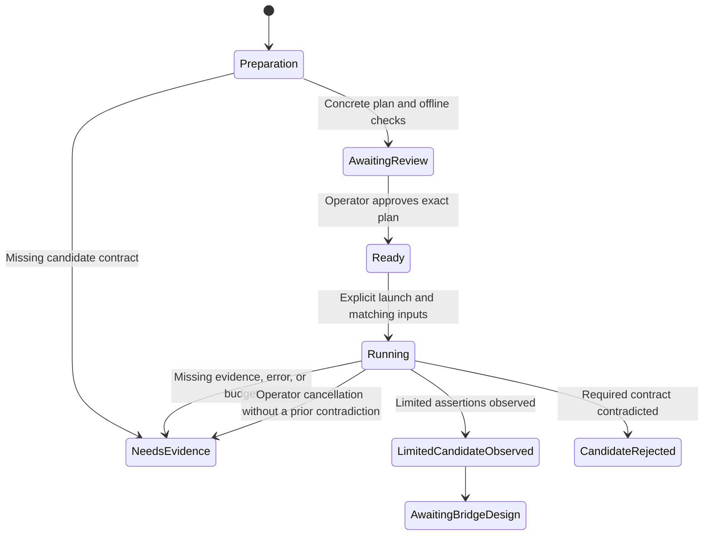

# 0003. First Claude Code loop, protocol feasibility

**Date**: 2026-10-01
**Status**: In Progress
**Revision review**: On 2026-10-01 you accepted a limited feasibility experiment with instructions carried in user context and clean stream end treated only as tentative completion. This supersedes the strict preparation gate for this experiment only. The prior profile amendment remains accepted. The first approved launch stopped at baseline preflight with zero inference attempts. The approved replacement using Claude Code `2.1.286` passed baseline checks but stopped because saved gateway configuration was absent. The subsequently approved local setup succeeded. Its approved run stopped during profile schema validation with zero inference attempts. The profile declaration correction was then approved. The latest run passed source validation, consumed one dispatch attempt, and stopped inconclusively before any decoded response event. After an expiry stop, you renewed the session and the gateway explicitly relinked it. The latest approved bounded error classifier run received HTTP 403 and the recognized class `access_denied` on its first request, then stopped. The subsequently approved Opus 5.5 comparison also received HTTP 403 and `access_denied` after explicit relinking. The exact failed access rule remains unknown. The feasibility result is `needs_evidence`; trace the native authentication and request path before another reviewed launch. See `verify.md`.

## Summary

You first test whether the current Kiro connection can carry the instructions, tool calls, and results that Claude Code needs. An explicitly invoked development harness limits the experiment to one selected Claude model and six inference attempts. You review the exact destination and synthetic request plan before any live run. This spec defines that feasibility milestone; the full bridge design and real Claude Code coding loop remain pending its evidence.

The profile amendment obtains the inference region from Kiro's selected profile, read alongside the pinned credential in one SQLite transaction. It makes that local source buildable with synthetic data. New static evidence identifies the candidate destination, authentication, and model control path. The limited experiment below deliberately measures changed instruction semantics and tentative completion; it cannot establish full compatibility.

## Requirements

As the local operator, you want a reproducible answer about the connection before building the production bridge. The eventual product proof is a small Go bug fix in a disposable repository, using Claude Code's own file and shell tools and normal permissions, followed by another user request. The initial compatibility baseline is Claude Code `2.1.285` and Kiro CLI `2.8.0` on this Mac.

The initial launch pinned Claude Code `2.1.285` but found installed version `2.1.286`. The replacement feasibility candidate uses `2.1.286`, with Kiro CLI `2.8.0` and Go `1.27.1` unchanged. This is prepared for review, not authorization for another launch. The future full coding loop baseline remains a separate bridge decision.

The following criteria apply to the feasibility milestone only. Satisfying them does not complete scope feature 4.

1. **AC-1**: Ordinary tests, the check script, and normal gateway commands neither use real credentials nor invoke live inference. The development harness needs an explicitly selected live entry point and a reviewed, exact experiment plan before any live request.
2. **AC-2**: Each live attempt uses one exact mapping from the saved configuration and one validated credential snapshot matching the saved fingerprint. A missing mapping, changed snapshot, expired credential, or unsupported source stops the run without renewal, fallback, or configuration changes.
3. **AC-3**: A live run attempts at most six inference requests, sequentially, within ten minutes. Each request has a two minute deadline and a 30 second stream idle limit. Cancellation stops local work promptly. No layer retries, replays, changes endpoints, or substitutes a model automatically.
4. **AC-4**: The experiment separately evaluates incremental text, instruction placement and behavior, tool definitions and identifiers, complete arguments, tool result continuation, and a subsequent user turn. A text response alone never establishes tool compatibility. This limited experiment carries the fixed instruction prefix in user content and explicitly reports that the distinct system role is not preserved.
5. **AC-5**: The experiment evaluates cancellation, interrupted output, and the evidence for successful upstream completion. A clean HTTP body end at a validated frame boundary may permit the next experimental case only after its text or tool assertions pass. It is tentative completion, never proof of a successful model turn. Truncation, stream exceptions, unknown events, and incomplete arguments still stop the run.
6. **AC-6**: Results retain run metadata, individual case outcomes, and reviewed synthetic protocol examples. Raw traffic, real credentials, fingerprints, account metadata, and ordinary coding conversations are not saved or printed.
7. **AC-7**: Missing or contradictory evidence stops the run and produces an explicit unresolved contract. No exhausted budget triggers another run. The full bridge remains blocked until this spec is extended through a new architecture decision using the evidence.
8. **AC-8**: Synthetic local checks prove the harness's credential selection, network restrictions, budgets, cancellation, incomplete result handling, and output filtering. Existing health and configuration behavior and the repository checks continue to pass.
9. **AC-9**: A combined source read selects only the fixed token and profile records in one transaction. Region comes from the profile ARN, independently of the Identity Center region. Missing, malformed, unsupported, or changed profile data stops the attempt before dispatch. Profile data and its digest remain in memory, and existing capture, configuration, and health behavior stay unchanged.

## Decision

**Chosen option**: A bounded development experiment before the full protocol bridge.

Keep Go, `net/http`, the existing SQLite reader safeguards, and the existing configuration model. Use a development test harness rather than a product probe command. Current public source and installed binary names supply candidate hypotheses, not a verified service contract. No new runtime library, development skill, or MCP server is selected. (basis: your choices, [project context](../../../AGENTS.md), specs [0001](../0001-stack-architecture/index.md) and [0002](../0002-local-configuration-credentials/index.md), research recorded in [rationale.md](rationale.md))

**Implementation skills**: `golang-security` (`samber/cc-skills-golang`, [SKILL.md](../../../.agents/skills/golang-security/SKILL.md)). Its applicable guidance covers credentials, destinations, bounded input, and allowed diagnostic fields.

This spec extends both accepted foundations. You accepted the feasibility design on October 1, 2026, after independent review and approval of its four corrections. This ratified the preparatory milestone, not a live destination or request body. Synthetic implementation has since advanced the spec to `In Progress`; the full bridge design and scope feature remain pending. No live experiment ran during design.

The implementation recommendations below select an explicit Go test entry point, a digest binding the reviewed plan to the run, fixed resource bounds, and a finite case sequence. A separate executable and a general experiment framework would add lifecycle and configuration work without improving this small proof. These recommendations are part of the final spec review. (basis: existing Go testing approach, explicit resource ownership, your development harness choice)

**Accepted profile amendment**: Extend the existing SQLite adapter with a combined credential and selected profile read for the harness. On October 1, 2026, you chose the selected Kiro profile record over an explicitly supplied experiment region, then accepted this amendment after independent review and correction. Keep the saved source identifier and token fingerprint formula unchanged. The profile is pinned only for the current run. This is a narrow additional read for feasibility, not a change to `account link` or permission to inspect the operator's store during preparation. No new dependency or credential type is selected. (basis: your sourcing choice, installed profile decoder evidence in [rationale.md](rationale.md), spec 0002 snapshot boundary)

## Feature design

### Boundary and readiness

This milestone can produce either a supported candidate for further design or a documented reason to stop. It does not add `/v1/messages`, token counting, a model catalogue, automatic sign in, or a production stream translator. No inference readiness assertion is added to `/healthz`.

Preparation and synthetic harness work may proceed from this spec after ratification. Live work additionally needs the completed candidate plan described below and your explicit review of that concrete plan. If a candidate cannot be specified within the approved account sources and the explicit limitations below, preparation ends with that missing evidence. The gate is a required input to an experiment, not permission for the builder to invent the production protocol.

After feasibility, `/architect` extends this same spec with the actual client endpoint inventory, field support, upstream request and event types, stream state machine, completion semantics, usage handling, model resolution, and real Claude Code verification. The original scope feature stays planned and needs a decision until that full design exists. The eventual proof still requires Claude Code to execute file and shell tools under its normal permissions.

### Limited experiment contract

You approved these two temporary limitations on October 1, 2026. They apply only to the development harness. The full bridge still owes its own instruction and completion design. This approval covers preparing the revised plan and local implementation, not reading your account or launching inference.

| Input or behavior | Exact source and rule |
|---|---|
| Destination | The current binary trace in `rationale.md` links GenerateAssistantResponse to `https://runtime.us-east-1.kiro.dev:443/` or `https://runtime.eu-central-1.kiro.dev:443/`, selected solely by the validated profile region. HTTPS POST, no override or fallback. |
| Authentication | `Authorization: Bearer <access_token>` from that attempt's combined snapshot; `profileArn` from the same snapshot. No other account record. |
| Operation | `Content-Type: application/x-amz-json-1.0` and `X-Amz-Target: KiroRuntimeService.GenerateAssistantResponse`, from the bundled ACP agent trace in `rationale.md`. This replaces the older streaming service target for the controlled comparison. Require an EventStream response content type and HTTP 200 before decoding. |
| Model and controls | Exact saved `claude-opus-5.5` mapping, approved and exercised in the recorded comparison run; that request was denied. Send `additionalModelRequestFields.max_tokens = 1024` and `thinking.type = disabled`, using the documented additional model field path. Opus 5.5 support for these values remains an explicit hypothesis; a rejection stops without dropping controls. Record requested control placement. If `metadataEvent.tokenUsage.outputTokens` is present, validate a finite nonnegative integer and compare with 1024 in memory. Emit only a nullable `output_within_limit` boolean. Absence remains unknown; neither a short answer nor an accepted request proves enforcement. |
| Instructions | Policy `translate_into_user_context`. Prepend the exact synthetic instruction text and two newlines to every current user message's `content`. Keep that content in history. Emit transformation label `instructions_in_user_content` and `distinct_system_role_preserved = false`. No equivalence or precedence claim. |
| Conversation | `conversationState` contains `conversationId`, `chatTriggerType: MANUAL`, `history`, and `currentMessage.userInputMessage`. The user message has `content`, `modelId`, `origin: CLI`, and, when needed, `userInputMessageContext`. Generate one UUID v4 with `crypto/rand` per run and reuse it across cases. No upstream identifier supplies a URL or changes the local conversation ID. |
| Tool definition | Cases 2 through 4 offer only `probe_lookup`, with description `Return the fixed value for key alpha.` and `inputSchema.json` containing an object schema, required string `key`, enum `["alpha"]`, and no additional properties. The `tools` array contains `toolSpecification`. |
| Tool continuation | Assemble at most one observed tool call from `toolUseEvent` fields `toolUseId`, `name`, `input` string fragments, and `stop` boolean. Require exact name, stable ID, stop true, and exactly `{"key":"alpha"}` after bounded JSON decoding. In history use `assistantResponseMessage.toolUses` with the observed ID, name, and decoded input. Case 3 sends `userInputMessageContext.toolResults` with that ID, `status: success`, and `content: [{"text":"probe-value-alpha"}]`. Never execute a supplied command. |
| Text assertions | Case 1 must assemble `PROBE_MARKER` in at least two nonempty text events. Case 3 must assemble `probe-value-alpha`; case 4 must assemble `probe-followup`. Ignore only surrounding whitespace for these marker comparisons. Missing text or a requested tool is inconclusive; a mismatched observed marker, tool, model, or argument schema is contradicted. No corrective request. |
| Cancellation and interruption | Case 5 cancels its child context after the first nonempty assistant text event. Case 6 cuts the received stream after 256 bytes. An unreached trigger is inconclusive. Both use separate synthetic prompts and no prior history, and neither contributes continuation history. |
| Completion | Label `clean_stream_end_tentative`. Only error free EOF at a CRC validated frame boundary, at least one expected text or complete tool result, no decoder failure, no cancellation, and successful local cleanup can permit continuation. `observed_completion` stays null; `tentative_completion` may be true. No stop reason is invented. A connection that ends cleanly after dropping whole frames may be undetectable, an accepted limitation of this experiment. |
| Event handling | Allow only the finite event and field sets in the concrete plan. Unknown names produce fixed counts and stop. Malformed JSON, duplicate members, changed tool IDs, unexpected tools, invalid model echoes, and any eventstream exception take precedence over tentative completion. Reasoning content is not carried into history; thinking is requested disabled, and a reasoning event stops as inconclusive. |
| Verdict | All six cases observed gives `limited_candidate_observed`. A contradicted assertion gives `candidate_rejected`; otherwise `needs_evidence`. This runner never emits `candidate_supported`. A limited result cannot close the full bridge or scope feature 4. |

The exact six prompts, synthetic example bodies, decoded field sets, resource limits, and source references live in `internal/kiro/testdata/probe-plan.json`. Code validates those plan semantics against the implemented contract before account access. Example placeholders represent the random local conversation ID, selected profile ARN, and observed tool ID; examples contain no account data. The supplied SHA 256 binds all plan bytes, including examples and provenance, and the clean commit binds the runner.

The output record adds only fixed transformation and completion labels, nullable booleans for tentative completion, controls requested, and output within the requested limit, plus local event counts. Numeric usage, upstream identifiers, prompts, arguments, results, and profile data never enter output. Keep the generic fixture runner's invented completion event isolated from this wire decoder.

### Diagnostic refinement

**Operation target comparison authorization**: After reviewing the two exact header values and the proposal for a single controlled comparison, you instructed, "yes, test them". This authorizes preparing and testing the new target offline and one bounded live run of that change. Record the clean code commit and updated plan digest before launch. All existing source checks, destination rules, Opus model, synthetic requests, budgets, output restrictions, and stop conditions still apply. Do not rerun the already denied old target, renew or relink credentials, change mappings, or launch the native client. This instruction authorizes the named comparison without another confirmation of its generated commit identifier; it does not authorize subsequent runs or broader protocol changes.

The first dispatch run's fixed `needs_evidence` category could not distinguish `http.Client.Do` failure from a non 200 response. The approved diagnostic plan adds three optional fixed labels per case: `failure_stage`, `transport_failure`, and `http_status_category`. You approved this change for the diagnostic launch at `b2490a92125e147b53a2eb6615ce17d952c61eea`; that launch stopped on credential expiry and does not authorize another run.

`failure_stage` comes from the local execution branch: `pre_dispatch`, `source`, `request_build`, `transport`, `http_status`, `response_headers`, `stream`, or `cleanup`. `transport_failure` comes from fixed dial branches (`dns`, `connect`, `destination_policy`), a TLS handshake completion callback (`tls`), a timeout type check (`timeout`), or `other`. HTTP response codes map locally to `ok`, `bad_request`, `unauthorized`, `forbidden`, `not_found`, `throttled`, `redirect`, `server_error`, or `other`. No raw status text, IP addresses, certificates, header values, request errors, or response bodies enter these labels.

That approved revision did not read error response bodies. The prepared extension below changes only the bounded diagnostic read. A non 200 response stays inconclusive and stops the sequence; a diagnostic label never makes an assertion observed or authorizes a retry. Code validates the plan's exact label sets. The inference requests, source selection, role and completion limitations, and all existing budgets stay unchanged.

### Error discriminator diagnostic

The authorization investigation identified named error discriminator sources in the installed decoder and the AWS JSON protocol. The next candidate keeps outbound requests unchanged and adds only `service_error` and `error_response_format` labels on non 200 responses. You approved this diagnostic for the run at `3511f2a4aac847f8582ff49cfc88139de7600ea6`; that run returned `access_denied` and its authorization is consumed.

Inspect `Content-Type` only to classify the response as `json`, `html`, `other`, `absent`, or `ambiguous`. Use exactly one `X-Amzn-Errortype` header of at most 256 visible ASCII bytes when present. Normalize the error type by removing the first colon and everything after it, then retaining the part after the first hash. Match only the finite input to output map in the plan. Empty, oversized, malformed, duplicate, or conflicting discriminators cannot produce a recognized label. An unrecognized spelling is `unknown`, never copied into output.

If that header is absent and content type is JSON (`application/json`, `application/x-amz-json-1.0`, or `application/x-amz-json-1.1`), read at most 16385 bytes to detect a body over the 16 KiB limit. Parse only a valid bounded JSON object without duplicate members. Read only the exact `code` and `__type` string members for classification. If both exist, their normalized values must agree. Other members, including `message`, are discarded and never emitted. Non JSON bodies stay unread. Read failures or an oversized body produce fixed diagnostic labels and never authorize replay. Existing request deadlines and transport limits cover this inspection. Reserve a fixed allowance of 64 times the body bound plus 64 KiB before the sequence to cover parser scratch and byte copies within the 16 MiB run budget.

Known labels are `access_denied`, `missing_authentication_token`, `internal_server_error`, `service_quota_exceeded`, `throttling`, and `service_unavailable`, plus `absent`, `unknown`, `ambiguous`, `unparseable`, `oversized`, and `unavailable`. The exact type spellings and mapping are frozen in the plan. These are reported error classes, not proof of a particular missing permission or successful authentication. The result stays inconclusive and the sequence stops at the same non 200 response. No raw error message, body, header, namespace, or suffix is printed or saved.

This approved policy supersedes `never_read_or_output` for the bounded classifier plan. Its exact policy name is `bounded_json_error_type_only`. The previously completed runs and their unread error bodies are unchanged; they cannot be retroactively classified.

### Current live disposition

The latest approved comparison at `d1fdd1a05ad7b6b9a112ed47ff756b14fa960bbe` requested `claude-opus-5.5` and received HTTP 403 with `service_error: access_denied` from the reviewed US runtime path on its first request. Explicit relinking, configuration checks, and local source validation passed. Five dependent cases were unrun. The model now matches the operator confirmed native test, but the denial persisted. Remote authentication, profile authorization, control support, and inference compatibility remain unproven; the exact failed access rule is unknown. The verdict is `needs_evidence`.

Further work should trace the native client's actual authentication and request path using new evidence before proposing another candidate. A native live comparison is a separate boundary because it may read additional state, refresh credentials, send telemetry, or retry. No automatic gateway retry, endpoint fallback, model change, account switch, or native client launch is allowed by the completed comparison.

### Approved model comparison candidate

The operator supplied a native session reference and then confirmed the successful official client test used Opus 5.5. Its bounded metadata names `claude-opus-5.5`; the conversation was not inspected. This does not establish Sonnet access or prove the cause of the earlier denial.

You approved exactly `claude-opus-5.5` as both the client mapping and requested model for the comparison at `d1fdd1a05ad7b6b9a112ed47ff756b14fa960bbe`. Before that run, the current fixed IAM Identity Center snapshot was explicitly linked and the exact Opus mapping saved using the existing configuration lock and atomic save. Follow the existing link rule: changed token bytes clear old mappings; unchanged bytes preserve them. Do not renew credentials or silently restore mappings cleared by relinking. The harness still reads only its exact selected mapping and never substitutes a model automatically. The current runtime path, credentials, prompts, tool fixture, role transformation, tentative completion, diagnostic policy, and all budgets stay unchanged. Requested controls remain explicit hypotheses for the new model. That approved setup and run are complete. The first Opus request returned HTTP 403 with `access_denied`; five dependent cases were unrun. The approval does not authorize another launch.

### Data model and lifetime

| Entity | Required fields and identity | Relationship and lifetime |
|---|---|---|
| Saved configuration | Existing version, listener, session source and fingerprint, exact model map | Unchanged schema and persistence from spec 0002. One selected session owns zero to 32 mappings. |
| Selected profile snapshot | Exact profile record bytes, parsed ARN, derived region, in memory profile digest | Read with the selected token in one transaction. Freeze the first validated profile digest for the run and require it on later attempts. No profile values are persisted. |
| Candidate plan | Stable case labels, evidence sources, exact host and path, method, authentication scheme, header names, body shapes, stream framing and assertions, allowed observation labels, synthetic inputs, client mapping name, exact target model, selected case sequence | One reviewed plan governs one explicitly started run. Only synthetic, nonsecret data may be checked into `internal/kiro/testdata/probe-plan.json`. |
| Run | Random local run ID, plan digest, start time, reviewed code commit, platform, observed client versions, requested model, attempted count, elapsed time, outcome | One run owns immutable plan and configuration snapshots and at most six attempts. Stored evidence is a reviewed summary, not a runtime database. |
| Attempt | Run ID and case label, request index, fresh credential snapshot, bounded synthetic conversation, event observations, outcome | One active attempt at a time. Tokens and raw response bytes remain in memory and are discarded at completion or failure. |
| Tool exchange | Exact tool ID, name, JSON arguments, matching result and error flag | Belongs to the synthetic conversation. Results are generated by the harness from fixed fixture logic, never by executing model supplied commands. |
| Synthetic protocol case | Unique case label, invented input and events, expected result, source observation reference | A regression fixture may be referenced by many runs. It is created from reviewed observations without copying a live response body. |

Run IDs and case labels are local identifiers, not upstream account identifiers. The plan digest is SHA 256 of the exact reviewed plan bytes; it is distinct from the sensitive credential fingerprint. Tool IDs are required when a tool is observed. Terminal reason, resolved model identity, usage, and upstream IDs are nullable observations in memory; absence means unknown and is never filled with a guessed value. The allowed output section defines which derived facts may be retained; raw upstream IDs are excluded.

The run summary identifies instruction or model control transformations by their reviewed plan labels. It records the exact requested model from that plan and, separately, whether the upstream supplied a matching model identity. It never prints an arbitrary upstream model string. An absent model echo cannot support a claim about an exact resolved identity. Runtime conversation data has no disk persistence. There is no schema migration.

### Candidate plan gate

The plan is a concrete artifact the operator can review before real credentials are read. It contains no access token, fingerprint, start URL, profile ARN, user identifier, or real conversation. The builder prepares these fields from inspected current artifacts or already recorded primary source evidence:

| Required plan item | Gate |
|---|---|
| Destination | Exact HTTPS scheme, service host, port 443, method, and path. No wildcard domain, user supplied request URL, environment endpoint override, or redirect destination. Explain how this destination applies to the selected sign in method. |
| Region rule | An explicit finite mapping from the selected profile ARN region to reviewed service hosts. The token's `region` is Identity Center metadata and is not a routing fallback. Unknown regions fail. Neither the ARN nor the sign in URL supplies a request URL. |
| Authentication | Exact header or signing scheme and its source. The selected token and the one profile record below are the only permitted account inputs. A need for SigV4 credentials, client secrets, other records, or another profile source is a new decision. Reading a profile does not establish that the token is authorized to use it. |
| Model | One exact saved mapping name and target ID. No alias expansion or fallback. The request itself must establish that access works; the mapping is not availability evidence. |
| Request schema | Exact synthetic fields for instructions, current input, history, tool schema, arguments, and tool results. Label which fields are evidenced and which are hypotheses under test. Include any required conversation or request IDs and their source or generation rule. |
| Controls | Exact requested output bounds and other model controls, their source, and the observation that would show they are honored. A locally enforced byte limit is not a model token limit. |
| Stream contract | Candidate framing, integrity checks, event names, field types, tool assembly rules, terminal evidence, and exception handling. Its decoder must pass the corresponding synthetic malformed input and truncation cases before live use. |
| Cases | Exact synthetic prompts and tools, required assertions, optional metadata observations, sequence dependencies, maximum attempts, and cancellation or interruption triggers. |
| Observation labels | Finite allowed event names, field paths, terminal labels, transformation labels, and assertion IDs. Each names the decoded field or local measurement behind it. Unknown strings are never added automatically. |
| Provenance and review | Installed version or primary source behind each claim, local fixture results, and unresolved hypotheses. The plan does not contain its own digest or the commit that contains it. Approval binds both separately through the procedure below. |

The static trace settles a candidate sign in path. It does not grant live approval: the exact completed plan, commit, and one run budget still require your review.

Hypotheses about service behavior are appropriate experiment inputs when clearly stated and reviewed. Guessing an authentication destination, reading an additional credential source, suppressing instructions, or claiming proven success from EOF is not. The explicit user context and tentative EOF policies above are permitted only for this limited experiment. If the inspection cannot produce the required plan fields, record `needs_evidence` and stop before live access. A changed plan, mapping, baseline, destination set, or execution code needs a new review before another launch.

Approval is a human workflow gate. First commit the complete harness, fixtures, plan, and offline evidence locally, leaving a clean checkout. Present its full Git commit ID, plan digest, exact mapping and target, permitted destinations, baseline versions, and six attempt budget. Your approval in the current conversation authorizes one launch of those reviewed inputs. A second launch needs fresh approval, including after a failed or canceled run. Copy that approval and the run result into this spec afterward, so recording it does not dirty the reviewed checkout before execution. There is no approval receipt file or runtime approval counter, and the Go harness does not parse conversation or spec prose to infer consent.

The plan may name a finite destination set for its supported profile regions before the real profile is read. Your live review approves that exact set and the use of whichever profile occupies the selected local record at the first attempt. The harness then chooses one destination from that set and freezes it for the run. It never prints the profile ARN or reads it early to prepare a plan. If you need approval bound to an exact account or profile across launches, that is a separate selection design; this run scoped pin does not provide it.

### Selected profile source and consistency

The additional source is the same fixed database as spec 0002, `<home>/Library/Application Support/kiro-cli/data.sqlite3`, table `main.state`, exact key `api.codewhisperer.profile`, JSON member `arn`. Static inspection connects the installed endpoint selector to this record and its decoder. The decoder also requires a profile name under `profileName` or `profile_name`. The harness validates that field's presence and string type, then discards it without using it for routing or identity. There is no stored region field established by this decoder. The source identifies Kiro's saved selected profile, not a verified association with the independently pinned Identity Center token.

The adapter's combined read accepts the existing saved session reference and returns the validated token, expiry, Identity Center region, profile ARN, profile region, and profile digest in memory. Keep fields private and prevent ordinary formatting or JSON serialization from exposing account data, as with the existing credential snapshot. A caller uses the ARN only in a wire field established by the candidate plan. The existing `Capture` and `ReadSnapshot` operations continue reading only the original token record. Normal gateway commands do not call the new combined read.

Reuse spec 0002's path, ownership, permission, symlink, SQLite URI, query only, and journal safeguards. Check `main.state` as an ordinary table with a plain declared `TEXT` key. For its plain `value` column, accept declared `TEXT` or `BLOB`, while still requiring the selected value to have SQLite storage type `text`. You approved this narrow declaration correction before the run at `3323e609a9404f27549944b3b8965b43f10991d8`, which passed local source selection. The `main.auth_kv` rules remain declared `TEXT` for both columns; no other type or source is added. Require `key` as the sole primary key. Bind each fixed key with `COLLATE BINARY`; do not accept a configurable table, key, path, profile name, or ARN. Check each selected value's type and byte length before reading it. Each value must be exactly one text row of 1 through 65536 bytes. Read metadata and both values in a single read transaction and one connection, within one five second deadline and the existing one second busy budget. Never scan other rows or read one record in a second transaction after validating the other.

Require valid UTF 8 and one JSON object without duplicate members at any depth. Require the exact `arn` member to be a nonempty string of at most 2048 visible ASCII bytes; do not trim, normalize, or accept case variants. Require exactly one of the exact members `profileName` and `profile_name`, with a JSON string value. Reject neither alias, both aliases even when equal, null, nonstring values, and case variants used in place of a recognized alias as `profile_invalid`. An empty name string is allowed; its contents have no routing or identity meaning. The enclosing record bound limits its size. Discard the decoded name after validation, while hashing the original record bytes as specified below. Ignore other additional members after bounded JSON validation. As a deliberately narrow gateway policy, accept only six colon separated ARN components with prefix `arn`, partition `aws`, service `codewhisperer`, a region of `us-east-1` or `eu-central-1`, a 12 digit account component, and a resource `profile/` followed by 1 through 128 ASCII letters, digits, underscores, or hyphens. This is an experiment restriction, not a claim about every valid Kiro profile format. Other partitions, regions, services, or resource formats return `profile_unsupported`. Extract the fourth component as the profile region. A different token region is allowed and must never replace it.

Before every attempt, validate the token and its existing saved fingerprint, then validate the profile from those same transaction bytes. Let `P` be the exact profile value bytes. Compute `SHA256(UTF8("kiro-gateway/probe-profile-v1") || 0x00 || P)` without JSON reencoding. The first successful combined read freezes that digest in the run. Later attempts require exact digest equality, even if only an ignored field or whitespace changes. They also retain the original destination. A changed token returns `session_changed`; a changed valid profile returns `profile_changed`. Missing or malformed profile data returns `profile_invalid`; an unsafe or unavailable database or table returns `source_unavailable`. Source timeout, cancellation, and expiry keep their existing categories. All failures stop before dispatch and use no inference slot.

The combined transaction prevents mixing rows from different SQLite snapshots. It does not prove that Kiro wrote both records atomically or that the account owns the selected profile. Remote authorization remains unverified until an approved request is accepted. The experiment neither repairs stale selections nor falls back to another record. Changing Kiro's saved profile through its own controls takes effect only in a separately approved run. No gateway configuration migration, relink requirement for a profile only change, or persistent profile fingerprint is introduced.

Static evidence identifies two candidate runtime hosts, `runtime.us-east-1.kiro.dev` and `runtime.eu-central-1.kiro.dev`, for their matching regions. The new operation and authentication trace supports these two candidates in the limited plan. Live use still requires review of that plan and an explicit launch. The legacy default host and Kiro endpoint settings are not read or inherited.

### Development surface

Use one live test entry point, `TestProtocolProbe`, in `internal/kiro/probe_live_test.go`, behind the `liveprobe` build tag. It also skips before reading configuration, credentials, or network state unless the explicit live gate is set. Keep the runner and experiment code in test files so they are not linked into the shipped gateway. Ordinary test files exercise the same core runner using synthetic snapshots and loopback test servers. Normal test execution excludes the live entry point even if live control variables or account credentials are inherited from the environment.

| Action | Inputs | Output | Authority and failure behavior |
|---|---|---|---|
| Prepare plan | Inspected current artifacts, recorded source evidence, invented cases, selected mapping name and target | Reviewed plan plus offline test evidence | No real credential access or inference. Missing contract produces `needs_evidence`. |
| Run local checks | Synthetic configuration, credential records, transport, clock, cancellation signals | Deterministic Go test results | Temporary homes and ephemeral loopback ports only. No operator store. |
| Explicit live run | `KIRO_GATEWAY_LIVE_PROBE=1`, `KIRO_GATEWAY_PROBE_PLAN_SHA256`, `KIRO_GATEWAY_PROBE_MODEL`, `KIRO_GATEWAY_PROBE_CODE_COMMIT`, reviewed plan | Allowed run summary and case outcomes | Same local user. Human review precedes launch. Runtime rejects code drift, digest mismatch, mapping mismatch, baseline drift, source mismatch, or a held process lock before dispatch. |
| Review evidence | Allowed summary, observed schema facts, synthetic replacements | Updated `verify.md` and rationale evidence, reviewed fixtures | Spec evidence is maintained through `/architect`; the harness never writes arbitrary traffic into the spec or repository. |

All four environment values are nonsecret controls, read once at startup. `KIRO_GATEWAY_PROBE_MODEL` is the exact client mapping key, not a model ID override. `KIRO_GATEWAY_PROBE_CODE_COMMIT` is the full reviewed Git commit ID. The plan digest and code ID detect accidental drift; they do not prove human approval or enforce one use across processes. That authority remains with your explicit review and launch. The harness has no token argument, credential path override, or generic destination flag.

Before credential access, require `HEAD` to equal the supplied reviewed commit and require no staged, unstaged, or untracked changes. All probe source, fixtures, and plan files must be tracked in that commit. Obtain Git state with fixed arguments and no shell interpolation; missing Git metadata or a failed check is `code_changed`. Read the plan bytes once, verify their digest, parse that exact buffer, and use the resulting immutable value for the whole run. Use the exact Go version in `go.mod`, with the repository's local toolchain, disabled workspace, cgo, and readonly module rules. Check the actual Claude Code and Kiro versions against the reviewed baseline. These are startup checks against accidental drift, not protection against another process acting as the same local user during a run.

After that review, the documented entry shape is:

```sh
rtk proxy env GOTOOLCHAIN=local GOWORK=off CGO_ENABLED=1 GOFLAGS= \
  KIRO_GATEWAY_LIVE_PROBE=1 \
  KIRO_GATEWAY_PROBE_PLAN_SHA256=<reviewed-plan-digest> \
  KIRO_GATEWAY_PROBE_MODEL=<exact-client-mapping> \
  KIRO_GATEWAY_PROBE_CODE_COMMIT=<reviewed-code-commit> \
  go test -mod=readonly -tags=liveprobe ./internal/kiro -run '^TestProtocolProbe$' -count=1 -parallel=1 -timeout=11m -v
```

The angle bracket values come from the concrete review; this is not a runnable command yet. Agents and operators must honor the human approval step; runtime checks cannot replace it. Clear fixed errors distinguish `plan_invalid`, `code_changed`, `baseline_changed`, `configuration_invalid`, `session_changed`, `profile_invalid`, `profile_unsupported`, `profile_changed`, `credential_expired`, `source_unavailable`, `budget_exhausted`, `canceled`, `timed_out`, `stream_incomplete`, `contract_mismatch`, and `needs_evidence`. There is no machine `plan_unreviewed` state. Do not print underlying Git, version command, transport, or database errors.

### Request ownership and safeguards

The live harness acquires the existing configuration process lock before loading settings and holds it through cleanup. It requires an existing linked configuration and exact model mapping. Load configuration once, validate it, and copy the selected mapping and session reference into the run's immutable inputs. Require the mapping to equal the reviewed plan. Do not reread the plan, mapping, or reference between attempts. Manual edits during a run are ignored, matching spec 0002's startup snapshot behavior; the lock excludes cooperating commands, not editors. Such edits affect a later run and may require a new plan review. The harness does not initialize, modify, relink, or upgrade settings. Concurrent serving or another mutator prevents a run. The normal gateway bearer token is not an inference credential; this development test is a local operator action rather than an HTTP endpoint.

For each attempt, reuse spec 0002's fixed source, ownership checks, SQLite schema checks, limits, transaction, and expiry rules. Read a fresh source snapshot, compute and compare its digest with the run's frozen reference, then use the access token from those same bytes. Never call `Capture` and reread for a token. If a reusable production credential method is needed, its interface belongs to the consuming Kiro boundary and returns only that validated snapshot to the adapter. It must not widen the capture command's output. A source change detected before a later attempt stops the run; a manual edit to saved settings cannot adopt that change for the active run.

With the profile amendment, use the combined read above for each harness attempt. Profile reads share that same operation deadline. They do not add an extra credential scan, extend the six attempt budget, or open a separate preflight inspection of the real store. Account source buffers and their retained copies count toward the existing 16 MiB run bound. Discard raw profile bytes after validation and hashing, retaining only the bounded fields needed by the active attempt and the frozen digest.

Do not invoke Kiro login, chat, profile, or model listing commands as part of live execution. Such commands may own refresh or other state changes that this experiment does not authorize. Version and help inspection during preparation are allowed. No refresh token or device registration record is needed.

Use an explicit HTTP transport with certificate verification, no environment proxy, no redirects, and no credentials forwarded to another host. Disable automatic retries, including transparent transport replay; a failed dispatch consumes an attempt. Local tests use only synthetic credentials. Production destinations come only from the reviewed finite mapping and the selected snapshot, never synthetic message content. No extra discovery, telemetry, login, or profile calls are in the approved six attempt sequence.

The run owns a parent context and each attempt has its own child context. Operator cancellation or the run deadline cancels the parent and prevents further dispatch. Attempt 5 deliberately cancels only its child when the reviewed trigger is reached. After its expected assertions pass and cleanup finishes, attempt 6 may start under the still active parent. The deliberate cutoff in attempt 6 is likewise an expected test action, not an unexpected run failure. Never reuse partial output from either attempt as continuation history.

Count an attempt immediately before dispatch, including a failed connection, a service authentication rejection, or an interrupted response. Local credential or plan rejection before dispatch consumes no inference attempt. Stop on any unexpected service error or unmet required assertion. The limits are ten minutes total, two minutes per request, 30 seconds without received stream bytes, and five seconds for cleanup after cancellation. Start the idle budget at dispatch and reset it only on received response bytes. A byte trickle cannot extend the overall deadlines. Cleanup uses the remaining run budget and is never allowed to start another attempt after the parent ends. Local source reads retain their five second limit and one second busy budget from spec 0002.

Cap synthetic request bodies at 64 KiB, response headers at 16 KiB, each response body at 8 MiB, and retained conversation and observations together at 16 MiB for a run. Count all retained copies, including tool arguments and decoded events. Check announced lengths before allocation. Crossing a bound is a stopped, inconclusive experiment, not successful truncation. These are experiment bounds, not claims about upstream model limits. TLS and dial work are included in the request deadline.

Raw network bodies remain bounded in memory. Response headers and unknown JSON members are not copied into logs. Go does not guarantee erasure of discarded memory.

### Allowed observation output

The harness emits only the following observation fields. Every variable label comes from the finite reviewed plan, never directly from an upstream string. Values observed in a live response stay in memory unless converted into these records.

| Field group | Allowed value and source |
|---|---|
| Run metadata | Local run ID, plan digest, checked code commit, platform, validated baseline versions, timestamps and elapsed times, and requested model and public destination taken from the frozen plan. |
| Case and ordering | Reviewed case and assertion IDs, attempt index, and locally counted event order. |
| Structure | Event names and field paths only when they exactly match a reviewed plan entry; value kinds from fixed enums such as `string`, `number`, `object`, `array`, `boolean`, and `null`. Unknown names become the fixed labels `unknown_event` or `unknown_field` with counts. No unknown spelling or value is emitted. |
| Measurements | Locally measured received bytes, retained bytes, argument bytes, event counts, request counts, and durations, checked against the experiment's resource bounds. Do not copy unvalidated numeric metadata from an upstream response. |
| Assertions | Boolean or null results for marker match, instruction placement, distinct system role preservation, controls requested, output within limit, valid arguments, matching tool name and ID, matching model identity, usage presence, observed completion, tentative completion, reached injection trigger, and completed cleanup. Null means not established. Terminal and transformation labels must match the reviewed plan's finite list; otherwise record `unknown`. |
| Outcome | The fixed case status, run verdict, and failure category defined in this spec. |
| Failure diagnostics | The three approved stage label sets, plus the prepared finite service error and response format labels above. The proposed JSON read is capped and retains no raw data; it requires a new exact plan review. |

stdout may contain the run summary and these structured observations. stderr is limited to fixed progress and failure categories, case labels, attempt indices, and local durations. Do not use arbitrary response text, raw tool names or IDs, arguments, result contents, upstream request IDs, raw model strings, unknown field names, or raw errors in either stream. Usage presence and a validated comparison against the requested output limit can be recorded; token counts are not emitted.

The reviewed evidence in `verify.md` may retain those allowed records, fixture labels, and human explanations grounded in them. Explain instruction or control differences by the named plan assertion and its outcome, not by copying a response excerpt. Write regression examples from invented content and allowed schema facts. Never turn a raw live body into a fixture by redaction or reencoding. New live fields remain unknown until a separate reviewed source establishes a safe label; runtime discovery cannot enlarge the output policy.

### Case sequence and verdicts

The candidate plan fixes the exact fields, decoder, and assertions before a live run. This sequence allocates the six attempts; it does not assume any request schema is already verified.

| Attempt | Purpose | Evidence required |
|---|---|---|
| 1 | Stream a short synthetic text response with a distinct instruction marker | Incremental event delivery, instruction field placement, requested controls, model evidence if present, and identified terminal behavior. One marker response is behavioral evidence, not proof of equivalent instruction precedence. |
| 2 | Offer a synthetic `probe_lookup` tool with a small JSON object schema | Tool name and ID, complete parseable arguments, schema behavior, and the event boundaries around the call. No local file or shell tool is executed. |
| 3 | Return a fixed result for the exact observed tool ID using the synthetic history | Correct result placement, ID matching, model continuation, and terminal behavior. The result comes from a fixture lookup keyed by validated arguments. |
| 4 | Submit a follow up synthetic user instruction with the accumulated bounded history | Continuation without losing prior instructions or tool exchanges; every generated or reused conversation ID has the source recorded in the plan. |
| 5 | Cancel during a streamed response | The planned trigger cancels only this attempt's child context, resources close within five seconds, and no success is fabricated. When those assertions pass, this case is observed and attempt 6 may follow. A trigger not reached is inconclusive. Local closure does not prove the remote service ceased computing or charging. |
| 6 | Cut the received stream at the plan's fixed boundary | Reaching the deliberate cutoff and reporting an incomplete response without fabricated success or replay makes this case observed. If the live boundary is never reached, the case and run remain inconclusive. |

An attempt that returns the wrong tool, no tool, missing arguments, an ambiguous ending, or an unexpected model does not trigger a corrective model call. Stop, retain the allowed findings, and mark dependent cases unrun. A separate local transport test always exercises abrupt termination within a frame and after a visible tool event, regardless of whether attempt 6 reaches the corresponding live point.

Each case is `observed`, `contradicted`, `inconclusive`, or `unrun`. `observed` means all its required assertions have evidence for this plan and version, not general compatibility. `contradicted` requires evidence that a required protocol assertion is false. Missing observations, a trigger not reached, authentication or transport failure, or operator cancellation are inconclusive rather than proof that a protocol assertion is false. Mark all remaining cases unrun when the run stops.

| Condition, evaluated in this order | Run verdict |
|---|---|
| A required protocol assertion is contradicted | `candidate_rejected`, preserving that evidence even if later cases were not run. |
| Every required assertion in all six cases is observed, including the expected cancellation and incomplete stream outcomes | `limited_candidate_observed`. Instruction and completion limitations, plus optional metadata limits, remain stated. |
| Any other result, including an unreached case 6 cutoff, spontaneous truncation, budget exhaustion, local cleanup failure, or operator cancellation | `needs_evidence`, with the fixed cause and remaining unrun cases. |

Required assertions cover incremental output, the instruction mapping assessment, intact tools and result continuation, follow up history, the explicitly limited tentative completion checks for cases 1 through 4, and the deliberate failure behavior of cases 5 and 6. The only optional observations are an upstream model identity echo and usage metadata. Their absence cannot make a run fail, but it limits the resulting claims. A spontaneous failure is not a substitute for the planned injection trigger. The approved transformation and tentative EOF policy permit this limited experiment to proceed without those two guarantees. They never justify `candidate_supported` or full compatibility.

Keep the instruction mapping assessment separate from a prompt following test. Likewise, a model request accepted under an exact configured ID is evidence of that request's acceptance, not independent proof of the model's internal identity. Usage presence is recorded as observed or unavailable. No token counts or pricing estimate are added.



No terminal state starts another run. A successful experiment permits further architecture work, not automatic promotion of the adapter.

### Value sourcing

| Action | Value | Named source |
|---|---|---|
| Prepare experiment | Destination, authentication, schema, framing, terminal hypothesis | Current binary and primary documentation recorded in the candidate plan, plus the explicitly approved instruction and tentative completion policies above. The completed plan still needs one run review. |
| Bind run | Plan digest and immutable plan | Read `probe-plan.json` once, verify SHA 256 of that buffer against the explicit launch value, then parse and retain it. Human review names that same digest separately. |
| Check code | Reviewed commit and clean state | Explicit `KIRO_GATEWAY_PROBE_CODE_COMMIT`, equality with Git `HEAD`, and no staged, unstaged, or untracked changes before credential access. Human review names the same commit. |
| Identify run | Run ID, start time, elapsed time | `crypto/rand` local ID, wall clock date, and monotonic timing; injected in local tests. |
| Record versions | Gateway revision, OS and architecture, client versions | Checked clean commit, local platform, and validated version command outputs. Version drift ends this baseline's experiment until reviewed. |
| Select model | Client name and requested upstream ID | Startup copy of the launch mapping name, the configuration loaded once under lock, and equality with the frozen reviewed plan. Later manual edits are ignored. |
| Obtain credential | Token, expiry, region | One validated `auth_kv.value` snapshot from the exact spec 0002 source; token never enters evidence. |
| Obtain profile | Profile ARN and profile region | Exact `arn` member of `main.state.value` at key `api.codewhisperer.profile`, read in the same transaction as the token; region is the validated fourth ARN component. Neither value enters evidence. |
| Validate profile shape | Presence and type of profile name | Exactly one of the exact `profileName` or `profile_name` members in that same object is a string. Its decoded value is discarded, not returned or emitted. |
| Pin profile | Expected and observed profile digest | The specified domain separated SHA 256 of exact profile bytes. Freeze the first valid read in memory; compare later fresh reads without persistence or output. |
| Select destination | One public destination and its allowed output label | Frozen reviewed plan's finite map indexed by the validated profile region. A missing entry fails; token region and source strings never supply a URL. |
| Check session | Expected and observed fingerprint | Frozen startup reference and the digest of each attempt's fresh source snapshot, compared in memory and omitted from output. |
| Form conversation | Instructions, messages, tool schema, fixed result | Reviewed synthetic fixtures, plus bounded prior synthetic responses for continuation. |
| Match tool result | Tool ID, name, arguments | Decoded observed event from attempt 2; use exactly that ID in attempt 3. |
| Generate protocol IDs | Any required request or conversation ID | The rule or prior response field named in the candidate plan; an unnamed source blocks the plan. |
| Evaluate output | Model match, usage presence, completion, event order | Comparisons and observations from named decoded fields and validated framing. Emit only the allowed booleans, plan labels, and local counts above. |
| Describe structure | Safe event labels, field paths, kinds, transformation outcomes | Exact matches to the frozen plan's finite labels, plus decoded value kinds and named assertion results. Unknown input is represented only by fixed labels and counts. |
| Enforce bounds | Attempt count, deadlines, idle clock, bytes | Fixed limits above and local counters, measured before dispatch and allocation. |
| Save evidence | Case verdict and missing contract | Case assertions compared with bounded observations, reviewed before entry in the spec. |

### Critical verification

Use synthetic SQLite fixtures, isolated configuration, controllable transports, and Go `testing` and `httptest`. The [verification checklist](verify.md) maps the cases to all acceptance criteria. A live model result is separate evidence and is never a deterministic test expectation.

Critical cases include a complete synthetic tool result and follow up exchange (**AC-4**), a source replacement between validation and token use (**AC-2**), inherited live controls during ordinary checks (**AC-1**), and a truncated stream after a visible tool call (**AC-5**). Their outcomes must remain free of sentinel credentials and conversation content (**AC-6**).

## Build plan

Follow the Tracer Bullet approach by proving one bounded path through the harness before broadening the cases.

**Resume point for the limited amendment**: The six case synthetic harness and profile snapshot reader are complete. Build the concrete limited wire contract through that shared snapshot and transport path, preserving its safeguards and generic fixture checks. Then present the exact plan and clean commit for one run review. Live execution, independent GA verification, and the full Claude Code bridge remain separate pending work.

1. **Prepare the concrete experiment and one offline thread.** Inspect the candidate contract without credential access, prepare the plan, and implement the opt in runner from synthetic configuration through snapshot comparison, transport, and filtered result. Exercise a single text stream locally, including an incomplete response. If the plan cannot be completed, report the missing contract and stop before live work. Satisfies **AC-1**, **AC-2**, **AC-5**, **AC-6**, **AC-7**, **AC-8**.
2. **Complete controls, then review the live plan.** Verify exact destination restrictions, immutable inputs, snapshot consistency, sequential budgets, separate run and attempt cancellation, verdict rules, and allowed observations using local fixtures. Commit the complete candidate harness and plan, then present that clean code commit, plan digest, synthetic bodies, and passing local checks for your review. Approval is for one bounded run and does not authorize implementation of an assumed production bridge. Satisfies **AC-1**, **AC-2**, **AC-3**, **AC-5**, **AC-6**, **AC-8**.
3. **Run the approved thin proof and extend through tool continuation.** After explicit launch, perform the six prescribed attempts in dependency order, stopping at the first unmet required contract. Complete synthetic tool and failure checks before their corresponding live attempts. Record useful negative evidence instead of enlarging the budget. Satisfies **AC-2**, **AC-3**, **AC-4**, **AC-5**, **AC-6**, **AC-7**, **AC-8**.
4. **Review the evidence and return to architecture.** Run the repository checks for any implementation changes, apply the scope's GA verification, tests, separate review, and documentation workflow to the harness, and update the spec evidence through `/architect`. Resolve the full bridge's decisions only when their sources are established. No step marks the real coding loop complete. Satisfies **AC-1** through **AC-8**.

## Consequences

**Benefit**: You can stop an unsuitable access path before investing in a production translator, with a repeatable record of what failed.

**Tradeoff**: This adds an experiment and another design pass before the first real Claude Code task. Six attempts may be insufficient to establish the contract. Live requests may consume Kiro account credits, and cancellation cannot promise a billing reversal. No monetary estimate is available from the reviewed evidence.

**Limit**: Neither historical source, static binary strings, nor a successful synthetic tool exchange establishes full Claude Code compatibility, both model families, long conversations, renewal, or dependable daily operation.

**Profile tradeoff**: Reading the selected profile avoids assuming the Identity Center region is the inference region. It also adds a private record dependency and only pins selection within one run. The deliberately narrow ARN policy can reject otherwise valid accounts; broadening it requires evidence and review. Reverting the unused combined reader needs no configuration or database migration.

## Follow-up

1. Complete and review the candidate plan before any live credential access. Its exact destination, authentication, wire schema, and limited completion policy remain experiment inputs, not accepted production decisions.
2. Return to `/architect first real Claude Code coding loop` with the experiment results. Extend this spec with the complete bridge design or document why the selected access path cannot meet the accepted architecture.
3. The later live proof must use Claude Code `2.1.285`, Kiro CLI `2.8.0`, the recorded available Sonnet model, and a disposable Go bug fixture. Preserve the original scope's file edits, shell tools, permission ownership, follow up turn, and failure evidence.
4. Scope feature 4 remains planned and needs a decision. Finishing this preparatory milestone does not advance its full design checkbox or mark the feature done.
5. Any durable context change after implementation belongs to `/sync`. No new tool installation or previously declined tooling offer is needed for this design.
6. Use the completed profile snapshot slice for the limited wire preparation. Present the plan digest and clean commit after synthetic verification. The two full compatibility guarantees remain unresolved even if the limited experiment observes all six cases.

## Rationale

Reasoning, alternatives, observed facts, and verified sources: see [rationale.md](rationale.md).
