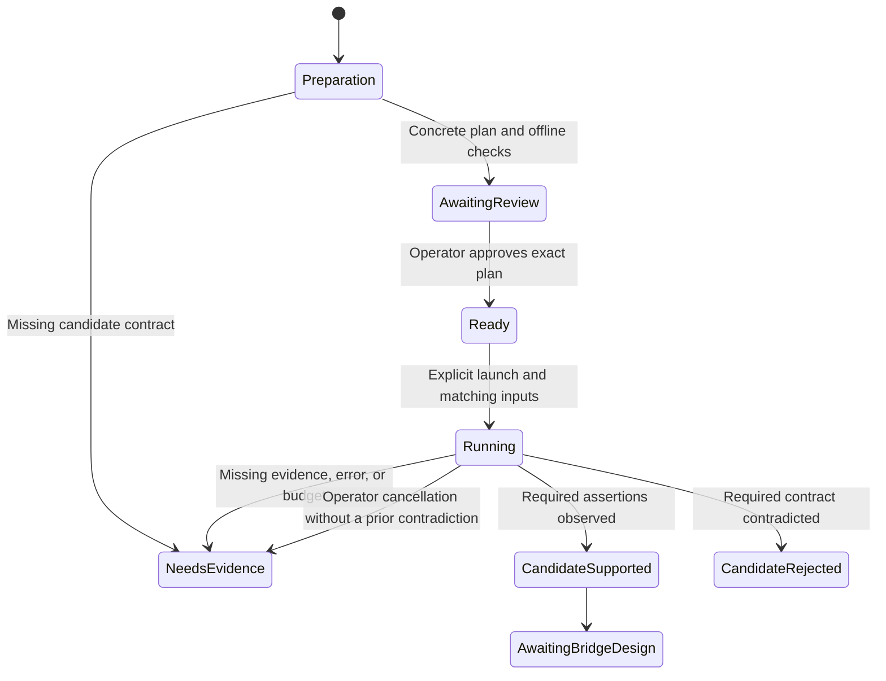

# 0003. First Claude Code loop, protocol feasibility

**Date**: 2026-10-01
**Status**: In Progress

## Summary

You first test whether the current Kiro connection can carry the instructions, tool calls, and results that Claude Code needs. An explicitly invoked development harness limits the experiment to one selected Sonnet model and six inference attempts. You review the exact destination and synthetic request plan before any live run. This spec defines that feasibility milestone; the full bridge design and real Claude Code coding loop remain pending its evidence.

## Requirements

As the local operator, you want a reproducible answer about the connection before building the production bridge. The eventual product proof is a small Go bug fix in a disposable repository, using Claude Code's own file and shell tools and normal permissions, followed by another user request. The initial compatibility baseline is Claude Code `2.1.285` and Kiro CLI `2.8.0` on this Mac.

The following criteria apply to the feasibility milestone only. Satisfying them does not complete scope feature 4.

1. **AC-1**: Ordinary tests, the check script, and normal gateway commands neither use real credentials nor invoke live inference. The development harness needs an explicitly selected live entry point and a reviewed, exact experiment plan before any live request.
2. **AC-2**: Each live attempt uses one exact mapping from the saved configuration and one validated credential snapshot matching the saved fingerprint. A missing mapping, changed snapshot, expired credential, or unsupported source stops the run without renewal, fallback, or configuration changes.
3. **AC-3**: A live run attempts at most six inference requests, sequentially, within ten minutes. Each request has a two minute deadline and a 30 second stream idle limit. Cancellation stops local work promptly. No layer retries, replays, changes endpoints, or substitutes a model automatically.
4. **AC-4**: The experiment separately evaluates incremental text, instruction placement and behavior, tool definitions and identifiers, complete arguments, tool result continuation, and a subsequent user turn. A text response alone never establishes tool compatibility or preservation of instruction roles.
5. **AC-5**: The experiment evaluates cancellation, interrupted output, and the evidence for successful upstream completion. A connection closing, valid JSON, a completed tool argument, or an HTTP 200 alone never proves a successful model turn.
6. **AC-6**: Results retain run metadata, individual case outcomes, and reviewed synthetic protocol examples. Raw traffic, real credentials, fingerprints, account metadata, and ordinary coding conversations are not saved or printed.
7. **AC-7**: Missing or contradictory evidence stops the run and produces an explicit unresolved contract. No exhausted budget triggers another run. The full bridge remains blocked until this spec is extended through a new architecture decision using the evidence.
8. **AC-8**: Synthetic local checks prove the harness's credential selection, network restrictions, budgets, cancellation, incomplete result handling, and output filtering. Existing health and configuration behavior and the repository checks continue to pass.

## Decision

**Chosen option**: A bounded development experiment before the full protocol bridge.

Keep Go, `net/http`, the existing SQLite reader safeguards, and the existing configuration model. Use a development test harness rather than a product probe command. Current public source and installed binary names supply candidate hypotheses, not a verified service contract. No new runtime library, development skill, or MCP server is selected. (basis: your choices, [project context](../../../AGENTS.md), specs [0001](../0001-stack-architecture/index.md) and [0002](../0002-local-configuration-credentials/index.md), research recorded in [rationale.md](rationale.md))

**Implementation skills**: `golang-security` (`samber/cc-skills-golang`, [SKILL.md](../../../.agents/skills/golang-security/SKILL.md)). Its applicable guidance covers credentials, destinations, bounded input, and allowed diagnostic fields.

This is a new spec extending both accepted foundations. You accepted the feasibility design on October 1, 2026, after independent review and approval of its four corrections. This ratifies the preparatory milestone, not a live destination or request body. No live experiment ran during design. The feature linked lifecycle status stays `Proposed` until implementation begins; the full bridge design and scope feature remain pending.

The implementation recommendations below select an explicit Go test entry point, a digest binding the reviewed plan to the run, fixed resource bounds, and a finite case sequence. A separate executable and a general experiment framework would add lifecycle and configuration work without improving this small proof. These recommendations are part of the final spec review. (basis: existing Go testing approach, explicit resource ownership, your development harness choice)

## Feature design

### Boundary and readiness

This milestone can produce either a supported candidate for further design or a documented reason to stop. It does not add `/v1/messages`, token counting, a model catalogue, automatic sign in, or a production stream translator. No inference readiness assertion is added to `/healthz`.

Preparation and synthetic harness work may proceed from this spec after ratification. Live work additionally needs the completed candidate plan described below and your explicit review of that concrete plan. If a candidate cannot be specified without inventing credential sources or silently changing instruction roles, preparation ends with that missing evidence. The gate is a required input to an experiment, not permission for the builder to invent the production protocol.

After feasibility, `/architect` extends this same spec with the actual client endpoint inventory, field support, upstream request and event types, stream state machine, completion semantics, usage handling, model resolution, and real Claude Code verification. The original scope feature stays planned and needs a decision until that full design exists. The eventual proof still requires Claude Code to execute file and shell tools under its normal permissions.

### Data model and lifetime

| Entity | Required fields and identity | Relationship and lifetime |
|---|---|---|
| Saved configuration | Existing version, listener, session source and fingerprint, exact model map | Unchanged schema and persistence from spec 0002. One selected session owns zero to 32 mappings. |
| Candidate plan | Stable case labels, evidence sources, exact host and path, method, authentication scheme, header names, body shapes, stream framing and assertions, allowed observation labels, synthetic inputs, client mapping name, exact target model, selected case sequence | One reviewed plan governs one explicitly started run. Only synthetic, nonsecret data may be checked into `internal/kiro/testdata/probe-plan.json`. |
| Run | Random local run ID, plan digest, start time, reviewed code commit, platform, observed client versions, requested model, attempted count, elapsed time, outcome | One run owns immutable plan and configuration snapshots and at most six attempts. Stored evidence is a reviewed summary, not a runtime database. |
| Attempt | Run ID and case label, request index, fresh credential snapshot, bounded synthetic conversation, event observations, outcome | One active attempt at a time. Tokens and raw response bytes remain in memory and are discarded at completion or failure. |
| Tool exchange | Exact tool ID, name, JSON arguments, matching result and error flag | Belongs to the synthetic conversation. Results are generated by the harness from fixed fixture logic, never by executing model supplied commands. |
| Synthetic protocol case | Unique case label, invented input and events, expected result, source observation reference | A regression fixture may be referenced by many runs. It is created from reviewed observations without copying a live response body. |

Run IDs and case labels are local identifiers, not upstream account identifiers. The plan digest is SHA 256 of the exact reviewed plan bytes; it is distinct from the sensitive credential fingerprint. Tool IDs are required when a tool is observed. Terminal reason, resolved model identity, usage, and upstream IDs are nullable observations in memory; absence means unknown and is never filled with a guessed value. The allowed output section defines which derived facts may be retained; raw upstream IDs are excluded.

The run summary identifies instruction or model control transformations by their reviewed plan labels. It records the exact requested model from that plan and, separately, whether the upstream supplied a matching model identity. It never prints an arbitrary upstream model string. An absent model echo cannot support a claim about an exact resolved identity. Runtime conversation data has no disk persistence. There is no schema migration.

### Candidate plan gate

The plan is a concrete artifact the operator can review before real credentials are read. It contains no access token, fingerprint, start URL, profile ARN, user identifier, or real conversation. The builder prepares these fields from inspected current artifacts or already recorded primary source evidence:

| Required plan item | Gate |
|---|---|
| Destination | Exact HTTPS scheme, service host, port 443, method, and path. No wildcard domain, user supplied request URL, environment endpoint override, or redirect destination. Explain how this destination applies to the selected sign in method. |
| Region rule | An explicit finite mapping from a supported credential `region` to the reviewed service host. Unknown regions fail. The sign in URL never supplies a network destination. |
| Authentication | Exact header or signing scheme and its source. Only the selected snapshot's access token is currently available. A need for SigV4 credentials, profile metadata from another source, client secrets, or other records is a new decision, not permission to obtain them. |
| Model | One exact saved mapping name and target ID. No alias expansion or fallback. The request itself must establish that access works; the mapping is not availability evidence. |
| Request schema | Exact synthetic fields for instructions, current input, history, tool schema, arguments, and tool results. Label which fields are evidenced and which are hypotheses under test. Include any required conversation or request IDs and their source or generation rule. |
| Controls | Exact requested output bounds and other model controls, their source, and the observation that would show they are honored. A locally enforced byte limit is not a model token limit. |
| Stream contract | Candidate framing, integrity checks, event names, field types, tool assembly rules, terminal evidence, and exception handling. Its decoder must pass the corresponding synthetic malformed input and truncation cases before live use. |
| Cases | Exact synthetic prompts and tools, required assertions, optional metadata observations, sequence dependencies, maximum attempts, and cancellation or interruption triggers. |
| Observation labels | Finite allowed event names, field paths, terminal labels, transformation labels, and assertion IDs. Each names the decoded field or local measurement behind it. Unknown strings are never added automatically. |
| Provenance and review | Installed version or primary source behind each claim, local fixture results, and unresolved hypotheses. The plan does not contain its own digest or the commit that contains it. Approval binds both separately through the procedure below. |

No candidate plan is approved at spec creation. In particular, the hostname strings and historical `GenerateAssistantResponse` operation in the rationale do not authorize sending a token to either a legacy host or a newer runtime host. The plan must settle the sign in path first.

Hypotheses about service behavior are appropriate experiment inputs when clearly stated and reviewed. Guessing an authentication destination, reading an additional credential source, suppressing instructions, or treating EOF as success is not. If the inspection cannot produce the required plan fields, record `needs_evidence` and stop before live access. A changed plan, mapping, baseline, destination set, or execution code needs a new review before another launch.

Approval is a human workflow gate. First commit the complete harness, fixtures, plan, and offline evidence locally, leaving a clean checkout. Present its full Git commit ID, plan digest, exact mapping and target, permitted destinations, baseline versions, and six attempt budget. Your approval in the current conversation authorizes one launch of those reviewed inputs. A second launch needs fresh approval, including after a failed or canceled run. Copy that approval and the run result into this spec afterward, so recording it does not dirty the reviewed checkout before execution. There is no approval receipt file or runtime approval counter, and the Go harness does not parse conversation or spec prose to infer consent.

### Development surface

Use one live test entry point, `TestProtocolProbe`, in `internal/kiro/probe_live_test.go`, behind the `liveprobe` build tag. It also skips before reading configuration, credentials, or network state unless the explicit live gate is set. Keep the runner and experiment code in test files so they are not linked into the shipped gateway. Ordinary test files exercise the same core runner using synthetic snapshots and loopback test servers. Normal test execution excludes the live entry point even if live control variables or account credentials are inherited from the environment.

| Action | Inputs | Output | Authority and failure behavior |
|---|---|---|---|
| Prepare plan | Inspected current artifacts, recorded source evidence, invented cases, selected mapping name and target | Reviewed plan plus offline test evidence | No real credential access or inference. Missing contract produces `needs_evidence`. |
| Run local checks | Synthetic configuration, credential records, transport, clock, cancellation signals | Deterministic Go test results | Temporary homes and ephemeral loopback ports only. No operator store. |
| Explicit live run | `KIRO_GATEWAY_LIVE_PROBE=1`, `KIRO_GATEWAY_PROBE_PLAN_SHA256`, `KIRO_GATEWAY_PROBE_MODEL`, `KIRO_GATEWAY_PROBE_CODE_COMMIT`, reviewed plan | Allowed run summary and case outcomes | Same local user. Human review precedes launch. Runtime rejects code drift, digest mismatch, mapping mismatch, baseline drift, source mismatch, or a held process lock before dispatch. |
| Review evidence | Allowed summary, observed schema facts, synthetic replacements | Updated `verify.md` and rationale evidence, reviewed fixtures | Spec evidence is maintained through `/architect`; the harness never writes arbitrary traffic into the spec or repository. |

All four environment values are nonsecret controls, read once at startup. `KIRO_GATEWAY_PROBE_MODEL` is the exact client mapping key, not a model ID override. `KIRO_GATEWAY_PROBE_CODE_COMMIT` is the full reviewed Git commit ID. The plan digest and code ID detect accidental drift; they do not prove human approval or enforce one use across processes. That authority remains with your explicit review and launch. The harness has no token argument, credential path override, or generic destination flag.

Before credential access, require `HEAD` to equal the supplied reviewed commit and require no staged, unstaged, or untracked changes. All probe source, fixtures, and plan files must be tracked in that commit. Obtain Git state with fixed arguments and no shell interpolation; missing Git metadata or a failed check is `code_changed`. Read the plan bytes once, verify their digest, parse that exact buffer, and use the resulting immutable value for the whole run. Use the exact Go version in `go.mod`, with the repository's local toolchain, disabled workspace, cgo, and readonly module rules. Check the actual Claude Code and Kiro versions against the reviewed baseline. These are startup checks against accidental drift, not protection against another process acting as the same local user during a run.

After that review, the documented entry shape is:

```sh
rtk proxy env GOTOOLCHAIN=local GOWORK=off CGO_ENABLED=1 GOFLAGS= \
  KIRO_GATEWAY_LIVE_PROBE=1 \
  KIRO_GATEWAY_PROBE_PLAN_SHA256=<reviewed-plan-digest> \
  KIRO_GATEWAY_PROBE_MODEL=<exact-client-mapping> \
  KIRO_GATEWAY_PROBE_CODE_COMMIT=<reviewed-code-commit> \
  go test -mod=readonly -tags=liveprobe ./internal/kiro -run '^TestProtocolProbe$' -count=1 -parallel=1 -timeout=11m -v
```

The angle bracket values come from the concrete review; this is not a runnable command yet. Agents and operators must honor the human approval step; runtime checks cannot replace it. Clear fixed errors distinguish `plan_invalid`, `code_changed`, `baseline_changed`, `configuration_invalid`, `session_changed`, `credential_expired`, `source_unavailable`, `budget_exhausted`, `canceled`, `timed_out`, `stream_incomplete`, `contract_mismatch`, and `needs_evidence`. There is no machine `plan_unreviewed` state. Do not print underlying Git, version command, transport, or database errors.

### Request ownership and safeguards

The live harness acquires the existing configuration process lock before loading settings and holds it through cleanup. It requires an existing linked configuration and exact model mapping. Load configuration once, validate it, and copy the selected mapping and session reference into the run's immutable inputs. Require the mapping to equal the reviewed plan. Do not reread the plan, mapping, or reference between attempts. Manual edits during a run are ignored, matching spec 0002's startup snapshot behavior; the lock excludes cooperating commands, not editors. Such edits affect a later run and may require a new plan review. The harness does not initialize, modify, relink, or upgrade settings. Concurrent serving or another mutator prevents a run. The normal gateway bearer token is not an inference credential; this development test is a local operator action rather than an HTTP endpoint.

For each attempt, reuse spec 0002's fixed source, ownership checks, SQLite schema checks, limits, transaction, and expiry rules. Read a fresh source snapshot, compute and compare its digest with the run's frozen reference, then use the access token from those same bytes. Never call `Capture` and reread for a token. If a reusable production credential method is needed, its interface belongs to the consuming Kiro boundary and returns only that validated snapshot to the adapter. It must not widen the capture command's output. A source change detected before a later attempt stops the run; a manual edit to saved settings cannot adopt that change for the active run.

Do not invoke Kiro login, chat, profile, or model listing commands as part of live execution. Such commands may own refresh or other state changes that this experiment does not authorize. Version and help inspection during preparation are allowed. No refresh token or device registration record is needed.

Use an explicit HTTP transport with certificate verification, no environment proxy, no redirects, and no credentials forwarded to another host. Disable automatic retries, including transparent transport replay; a failed dispatch consumes an attempt. Local tests use only synthetic credentials. Production destinations come only from the reviewed finite mapping and the selected snapshot, never synthetic message content. No extra discovery, telemetry, login, or profile calls are in the approved six attempt sequence.

The run owns a parent context and each attempt has its own child context. Operator cancellation or the run deadline cancels the parent and prevents further dispatch. Attempt 5 deliberately cancels only its child when the reviewed trigger is reached. After its expected assertions pass and cleanup finishes, attempt 6 may start under the still active parent. The deliberate cutoff in attempt 6 is likewise an expected test action, not an unexpected run failure. Never reuse partial output from either attempt as continuation history.

Count an attempt immediately before dispatch, including a failed connection, a service authentication rejection, or an interrupted response. Local credential or plan rejection before dispatch consumes no inference attempt. Stop on any unexpected service error or unmet required assertion. The limits are ten minutes total, two minutes per request, 30 seconds without received stream bytes, and five seconds for cleanup after cancellation. Start the idle budget at dispatch and reset it only on received response bytes. A byte trickle cannot extend the overall deadlines. Cleanup uses the remaining run budget and is never allowed to start another attempt after the parent ends. Local source reads retain their five second limit and one second busy budget from spec 0002.

Cap synthetic request bodies at 64 KiB, response headers at 16 KiB, each response body at 8 MiB, and retained conversation and observations together at 16 MiB for a run. Count all retained copies, including tool arguments and decoded events. Check announced lengths before allocation. Crossing a bound is a stopped, inconclusive experiment, not successful truncation. These are experiment bounds, not claims about upstream model limits. TLS and dial work are included in the request deadline.

Raw network bodies remain bounded in memory. Response headers and unknown JSON members are not copied into logs. Go does not guarantee erasure of discarded memory.

### Allowed observation output

The harness emits only the following observation fields. Every variable label comes from the finite reviewed plan, never directly from an upstream string. Values observed in a live response stay in memory unless converted into these records.

| Field group | Allowed value and source |
|---|---|
| Run metadata | Local run ID, plan digest, checked code commit, platform, validated baseline versions, timestamps and elapsed times, and requested model and public destination taken from the frozen plan. |
| Case and ordering | Reviewed case and assertion IDs, attempt index, and locally counted event order. |
| Structure | Event names and field paths only when they exactly match a reviewed plan entry; value kinds from fixed enums such as `string`, `number`, `object`, `array`, `boolean`, and `null`. Unknown names become the fixed labels `unknown_event` or `unknown_field` with counts. No unknown spelling or value is emitted. |
| Measurements | Locally measured received bytes, retained bytes, argument bytes, event counts, request counts, and durations, checked against the experiment's resource bounds. Do not copy unvalidated numeric metadata from an upstream response. |
| Assertions | Boolean or null results for marker match, instruction placement, valid arguments, matching tool name and ID, matching model identity, usage presence, observed completion, reached injection trigger, and completed cleanup. Null means not established. Terminal and transformation labels must match the reviewed plan's finite list; otherwise record `unknown`. |
| Outcome | The fixed case status, run verdict, and failure category defined in this spec. |

stdout may contain the run summary and these structured observations. stderr is limited to fixed progress and failure categories, case labels, attempt indices, and local durations. Do not use arbitrary response text, raw tool names or IDs, arguments, result contents, upstream request IDs, raw model strings, unknown field names, or raw errors in either stream. Usage presence can be recorded; token counts are not needed for this experiment and are not emitted.

The reviewed evidence in `verify.md` may retain those allowed records, fixture labels, and human explanations grounded in them. Explain instruction or control differences by the named plan assertion and its outcome, not by copying a response excerpt. Write regression examples from invented content and allowed schema facts. Never turn a raw live body into a fixture by redaction or reencoding. New live fields remain unknown until a separate reviewed source establishes a safe label; runtime discovery cannot enlarge the output policy.

### Case sequence and verdicts

The candidate plan fixes the exact fields, decoder, and assertions before a live run. This sequence allocates the six attempts; it does not assume any request schema is already verified.

| Attempt | Purpose | Evidence required |
|---|---|---|
| 1 | Stream a short synthetic text response with a distinct instruction marker | Incremental event delivery, instruction field placement, requested controls, model evidence if present, and identified terminal behavior. One marker response is behavioral evidence, not proof of equivalent instruction precedence. |
| 2 | Offer a synthetic `probe_lookup` tool with a small JSON object schema | Tool name and ID, complete parseable arguments, schema behavior, and the event boundaries around the call. No local file or shell tool is executed. |
| 3 | Return a fixed result for the exact observed tool ID using the synthetic history | Correct result placement, ID matching, model continuation, and terminal behavior. The result comes from a fixture lookup keyed by validated arguments. |
| 4 | Submit a follow up synthetic user instruction with the accumulated bounded history | Continuation without losing prior instructions or tool exchanges; every generated or reused conversation ID has the source recorded in the plan. |
| 5 | Cancel during a streamed response | The planned trigger cancels only this attempt's child context, resources close within five seconds, and no success is fabricated. When those assertions pass, this case is observed and attempt 6 may follow. A trigger not reached is inconclusive. Local closure does not prove the remote service ceased computing or charging. |
| 6 | Cut the received stream at the plan's fixed boundary | Reaching the deliberate cutoff and reporting an incomplete response without fabricated success or replay makes this case observed. If the live boundary is never reached, the case and run remain inconclusive. |

An attempt that returns the wrong tool, no tool, missing arguments, an ambiguous ending, or an unexpected model does not trigger a corrective model call. Stop, retain the allowed findings, and mark dependent cases unrun. A separate local transport test always exercises abrupt termination within a frame and after a visible tool event, regardless of whether attempt 6 reaches the corresponding live point.

Each case is `observed`, `contradicted`, `inconclusive`, or `unrun`. `observed` means all its required assertions have evidence for this plan and version, not general compatibility. `contradicted` requires evidence that a required protocol assertion is false. Missing observations, a trigger not reached, authentication or transport failure, or operator cancellation are inconclusive rather than proof that a protocol assertion is false. Mark all remaining cases unrun when the run stops.

| Condition, evaluated in this order | Run verdict |
|---|---|
| A required protocol assertion is contradicted | `candidate_rejected`, preserving that evidence even if later cases were not run. |
| Every required assertion in all six cases is observed, including the expected cancellation and incomplete stream outcomes | `candidate_supported`. Optional metadata limits remain stated. |
| Any other result, including an unreached case 6 cutoff, spontaneous truncation, budget exhaustion, local cleanup failure, or operator cancellation | `needs_evidence`, with the fixed cause and remaining unrun cases. |

Required assertions cover incremental output, the instruction mapping assessment, intact tools and result continuation, follow up history, identified successful terminal semantics for cases 1 through 4, and the deliberate failure behavior of cases 5 and 6. The only optional observations are an upstream model identity echo and usage metadata. Their absence cannot make a run fail, but it limits the resulting claims. A spontaneous failure is not a substitute for the planned injection trigger. A missing terminal indicator or instruction role mapping blocks `candidate_supported`; it cannot be patched by treating connection close as completion or prepending a system instruction as ordinary user text.

Keep the instruction mapping assessment separate from a prompt following test. Likewise, a model request accepted under an exact configured ID is evidence of that request's acceptance, not independent proof of the model's internal identity. Usage presence is recorded as observed or unavailable. No token counts or pricing estimate are added.



No terminal state starts another run. A successful experiment permits further architecture work, not automatic promotion of the adapter.

### Value sourcing

| Action | Value | Named source |
|---|---|---|
| Prepare experiment | Destination, authentication, schema, framing, terminal hypothesis | Exact inspected artifact or recorded primary source identified in the reviewed candidate plan; no current approved value exists. Absence blocks live execution. |
| Bind run | Plan digest and immutable plan | Read `probe-plan.json` once, verify SHA 256 of that buffer against the explicit launch value, then parse and retain it. Human review names that same digest separately. |
| Check code | Reviewed commit and clean state | Explicit `KIRO_GATEWAY_PROBE_CODE_COMMIT`, equality with Git `HEAD`, and no staged, unstaged, or untracked changes before credential access. Human review names the same commit. |
| Identify run | Run ID, start time, elapsed time | `crypto/rand` local ID, wall clock date, and monotonic timing; injected in local tests. |
| Record versions | Gateway revision, OS and architecture, client versions | Checked clean commit, local platform, and validated version command outputs. Version drift ends this baseline's experiment until reviewed. |
| Select model | Client name and requested upstream ID | Startup copy of the launch mapping name, the configuration loaded once under lock, and equality with the frozen reviewed plan. Later manual edits are ignored. |
| Obtain credential | Token, expiry, region | One validated `auth_kv.value` snapshot from the exact spec 0002 source; token never enters evidence. |
| Check session | Expected and observed fingerprint | Frozen startup reference and the digest of each attempt's fresh source snapshot, compared in memory and omitted from output. |
| Form conversation | Instructions, messages, tool schema, fixed result | Reviewed synthetic fixtures, plus bounded prior synthetic responses for continuation. |
| Match tool result | Tool ID, name, arguments | Decoded observed event from attempt 2; use exactly that ID in attempt 3. |
| Generate protocol IDs | Any required request or conversation ID | The rule or prior response field named in the candidate plan; an unnamed source blocks the plan. |
| Evaluate output | Model match, usage presence, completion, event order | Comparisons and observations from named decoded fields and validated framing. Emit only the allowed booleans, plan labels, and local counts above. |
| Describe structure | Safe event labels, field paths, kinds, transformation outcomes | Exact matches to the frozen plan's finite labels, plus decoded value kinds and named assertion results. Unknown input is represented only by fixed labels and counts. |
| Enforce bounds | Attempt count, deadlines, idle clock, bytes | Fixed limits above and local counters, measured before dispatch and allocation. |
| Save evidence | Case verdict and missing contract | Case assertions compared with bounded observations, reviewed before entry in the spec. |

### Critical verification

Use synthetic SQLite fixtures, isolated configuration, controllable transports, and Go `testing` and `httptest`. The [verification checklist](verify.md) maps the cases to all acceptance criteria. A live model result is separate evidence and is never a deterministic test expectation.

Critical cases include a complete synthetic tool result and follow up exchange (**AC-4**), a source replacement between validation and token use (**AC-2**), inherited live controls during ordinary checks (**AC-1**), and a truncated stream after a visible tool call (**AC-5**). Their outcomes must remain free of sentinel credentials and conversation content (**AC-6**).

## Build plan

Follow the Tracer Bullet approach by proving one bounded path through the harness before broadening the cases.

1. **Prepare the concrete experiment and one offline thread.** Inspect the candidate contract without credential access, prepare the plan, and implement the opt in runner from synthetic configuration through snapshot comparison, transport, and filtered result. Exercise a single text stream locally, including an incomplete response. If the plan cannot be completed, report the missing contract and stop before live work. Satisfies **AC-1**, **AC-2**, **AC-5**, **AC-6**, **AC-7**, **AC-8**.
2. **Complete controls, then review the live plan.** Verify exact destination restrictions, immutable inputs, snapshot consistency, sequential budgets, separate run and attempt cancellation, verdict rules, and allowed observations using local fixtures. Commit the complete candidate harness and plan, then present that clean code commit, plan digest, synthetic bodies, and passing local checks for your review. Approval is for one bounded run and does not authorize implementation of an assumed production bridge. Satisfies **AC-1**, **AC-2**, **AC-3**, **AC-5**, **AC-6**, **AC-8**.
3. **Run the approved thin proof and extend through tool continuation.** After explicit launch, perform the six prescribed attempts in dependency order, stopping at the first unmet required contract. Complete synthetic tool and failure checks before their corresponding live attempts. Record useful negative evidence instead of enlarging the budget. Satisfies **AC-2**, **AC-3**, **AC-4**, **AC-5**, **AC-6**, **AC-7**, **AC-8**.
4. **Review the evidence and return to architecture.** Run the repository checks for any implementation changes, apply the scope's GA verification, tests, separate review, and documentation workflow to the harness, and update the spec evidence through `/architect`. Resolve the full bridge's decisions only when their sources are established. No step marks the real coding loop complete. Satisfies **AC-1** through **AC-8**.

## Consequences

**Benefit**: You can stop an unsuitable access path before investing in a production translator, with a repeatable record of what failed.

**Tradeoff**: This adds an experiment and another design pass before the first real Claude Code task. Six attempts may be insufficient to establish the contract. Live requests may consume Kiro account credits, and cancellation cannot promise a billing reversal. No monetary estimate is available from the reviewed evidence.

**Limit**: Neither historical source, static binary strings, nor a successful synthetic tool exchange establishes full Claude Code compatibility, both model families, long conversations, renewal, or dependable daily operation.

## Follow-up

1. Complete and review the candidate plan before any live credential access. Its exact destination, authentication, wire schema, and terminal evidence remain experiment inputs to establish, not accepted production decisions.
2. Return to `/architect first real Claude Code coding loop` with the experiment results. Extend this spec with the complete bridge design or document why the selected access path cannot meet the accepted architecture.
3. The later live proof must use Claude Code `2.1.285`, Kiro CLI `2.8.0`, the recorded available Sonnet model, and a disposable Go bug fixture. Preserve the original scope's file edits, shell tools, permission ownership, follow up turn, and failure evidence.
4. Scope feature 4 remains planned and needs a decision. Finishing this preparatory milestone does not advance its full design checkbox or mark the feature done.
5. Any durable context change after implementation belongs to `/sync`. No new tool installation or previously declined tooling offer is needed for this design.

## Rationale

Reasoning, alternatives, observed facts, and verified sources: see [rationale.md](rationale.md).
